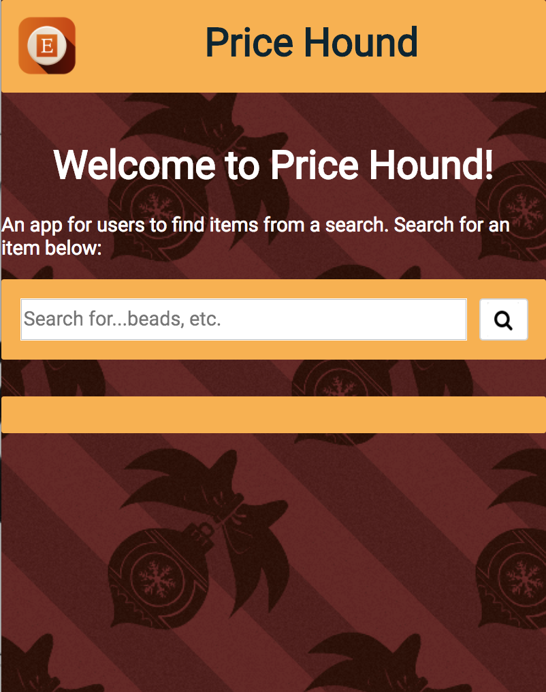
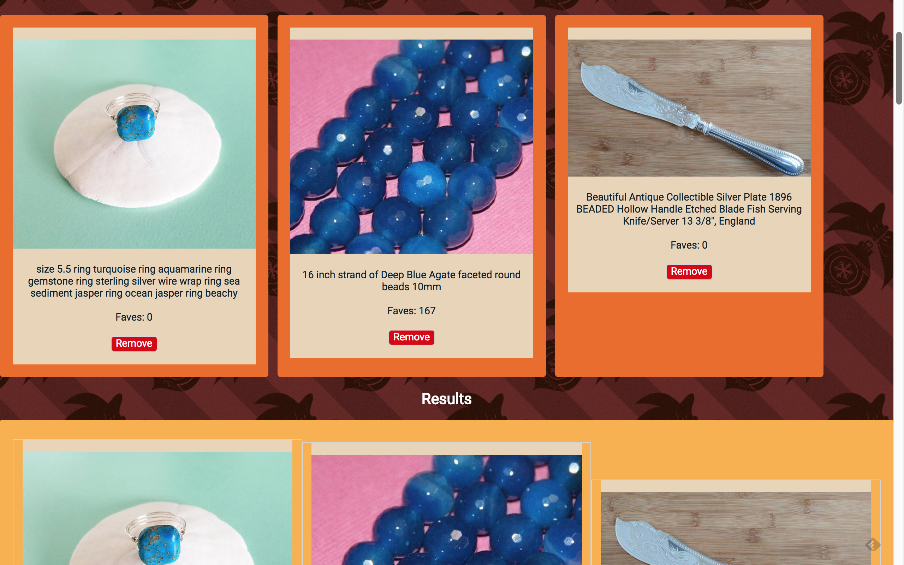

# Price Hound

## Introduction
The idea behind Price Hound was to let users select items based on a search query and to compare those items before committing to buy. Clicking on the select items also directs the user to Etsy where they may add to their cart and pay there.

## UX
Initial wireframes for the home page can be seen below.

The app was designed to work on mobile as well as tablet and desktop from the outset.

## Live Site
You can access Price Hound at https://nylfmedli14.github.io/price-hound/

## Technical
* The front-end is built using HTML5, CSS3 and JavaScript using the Etsy Data Api (https://www.etsy.com/developers/documentation/getting_started/api_basics).
* The app is responsive, adapting for mobile, table and desktop viewports.

